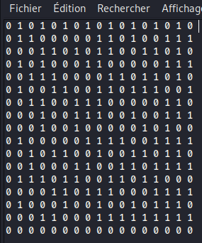
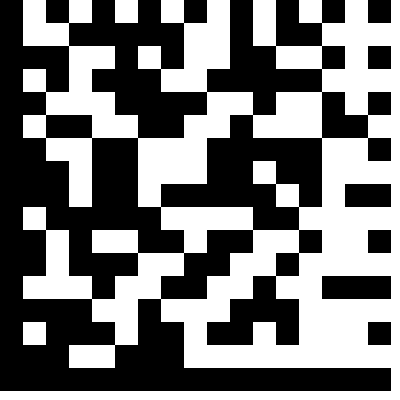
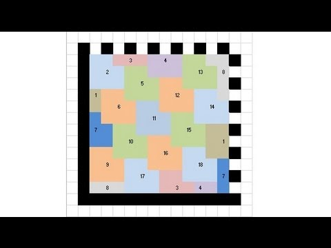
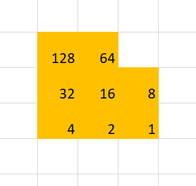
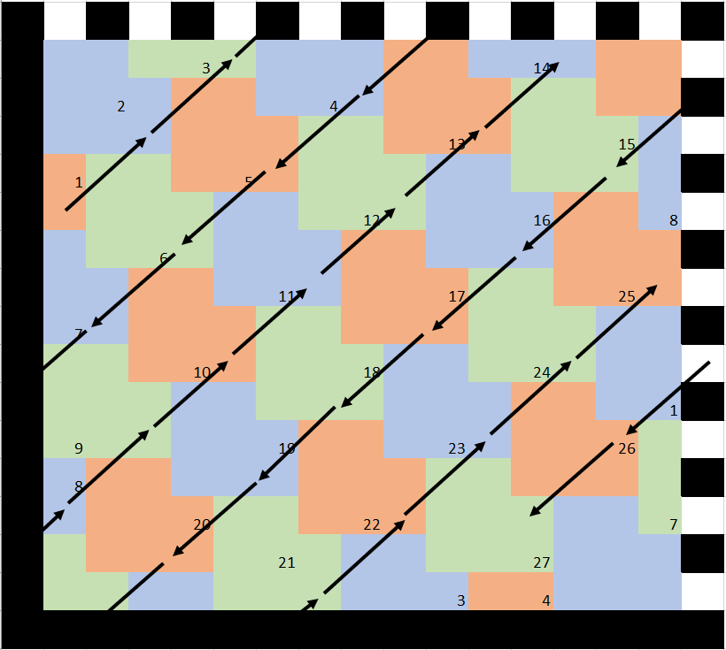
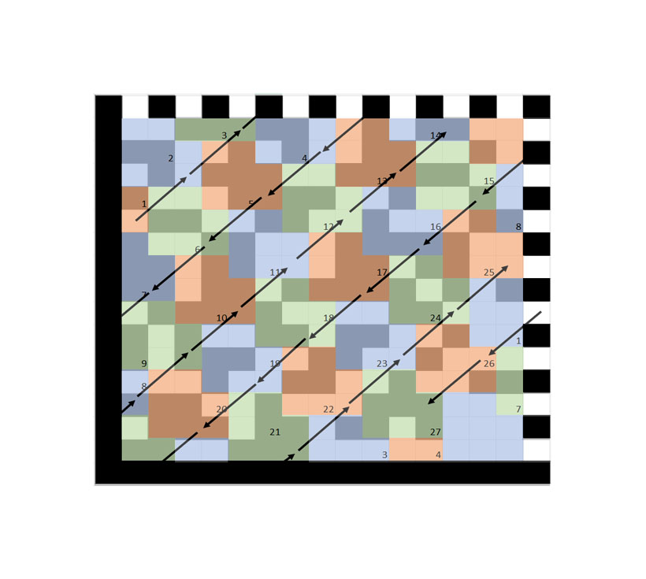

# Space

### Catégorie

Steganography

### Description


### Fichier

[scroll_of_truth](scroll_of_truth)


### Solution

C'est un challenge en plusieurs étapes : 

En ouvrant le fichier, on fait façe à un document vide. En regardant de plus près, on se rend compte qu'il y a de nombreux espaces, tabulations et retours à la ligne.
On peut donc imédiatement penser à du langage Whitespace. Après quelques essais peux concluants, on change de technique.

On décide alors d'y vois plus clair en convertissants ces chaines blanches en hexa.


En respectant les retours à la ligne (0x0a), la chaine est étonnament carré. De plus il n'y a que deux caractères. On peut donc penser à du binaire.
On remplace donc 0x09 par 0 et 0x20 par 1.
```
> sed -i -e "s/09/0/g" scroll_of_truth_hexa
> sed -i -e "s/20/1/g" scroll_of_truth_hexa

```
En elevant les caractères hexa du retour à la ligne, on obtient un carré de 17*17.



Lorsqu'on voit ainsi un carré parfait avec deux valeurs possibles, on pense imédiatement à un QRCode. 
En utilisant ce site : https://bahamas10.github.io/binary-to-qrcode/ on obtient une image intéressante :




Ce n'est malheureusement pas un QRCode mais plûtot son cousin éloigné, le Datamatrix.

On arrive maintenant à la partie la plus compliquée. En effet ce Datamatrix ne respecte pas le format standard. Il ne peut donc pas être décodé par un scanner ou pas un script trouvé sur internet.
Il doit être décodé à la main.

Après plusieurs recherches, on trouve des explications assez clairs sur comment le déchiffrer. 

Il faut remplir l'intérieur du datamatrix avec des patterns bien précis en forme de L.



et ensuite additionner les valeurs correspondantes aux cases noirs de chaques "L" selon ce modèle : 



Pour chaque pattern, on calcul la somme des cases noirs et on fais correspondre ce nombre à un code hexa décimal d'un caractère ASCII. On peut donc décoder un caractère par pattern de "L".

On revient donc sur notre Datamatrix et on applique la méthode en le remplissant de L.



Pour faciliter le calcul, on superpose notre remplissage avec les carrés de notre Datamatrix : 



La lecture se fait dans un sens bien spécifique comme indiquent les flèches.


### Flag

H2G2{1_4m_4_b1g_f47_p4nda}


